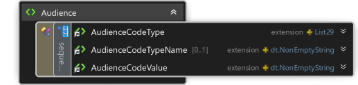
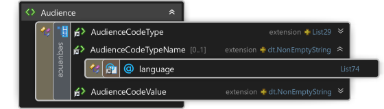

<table>
    <tr><th colspan="2">3.0.12</th></tr>
    <tr>
        <td></td>
        <td rowspan="3">

&lt;xs:element name="Audience"&gt;

&#160; &#160; &lt;xs:complexType&gt;

&#160; &#160; &#160; &#160; &lt;xs:sequence&gt;

&#160; &#160; &#160; &#160; &#160; &#160; &lt;xs:element ref="AudienceCodeType" /&gt;

&#160; &#160; &#160; &#160; &#160; &#160; &lt;xs:element ref="AudienceCodeTypeName" minOccurs="0" /&gt;

&#160; &#160; &#160; &#160; &#160; &#160; &lt;xs:element ref="AudienceCodeValue" /&gt;

&#160; &#160; &#160; &#160; &lt;/xs:sequence&gt;

&#160; &#160; &lt;/xs:complexType&gt;

&lt;/xs:element&gt;

</td>
    </tr>
    <tr><th>3.0.16</th></tr>
    <tr><td></td></tr>
</table>