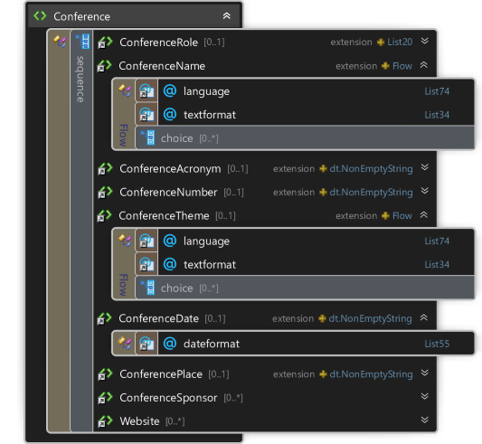

<table>
    <tr><th colspan="2">3.0.12</th></tr>
    <tr>
        <td></td>
        <td>
&lt;xs:element name="Conference"&gt;

&#160; &#160; &lt;xs:complexType&gt;

&#160; &#160; &#160; &#160; &lt;xs:sequence&gt;

&#160; &#160; &#160; &#160; &#160; &#160; &lt;xs:element ref="ConferenceRole" minOccurs="0" /&gt;

&#160; &#160; &#160; &#160; &#160; &#160; &lt;xs:element ref="ConferenceName" /&gt;

&#160; &#160; &#160; &#160; &#160; &#160; &lt;xs:element ref="ConferenceAcronym" minOccurs="0" /&gt;

&#160; &#160; &#160; &#160; &#160; &#160; &lt;xs:element ref="ConferenceNumber" minOccurs="0" /&gt;

&#160; &#160; &#160; &#160; &#160; &#160; &lt;xs:element ref="ConferenceTheme" minOccurs="0" /&gt;

&#160; &#160; &#160; &#160; &#160; &#160; &lt;xs:element ref="ConferenceDate" minOccurs="0" /&gt;

&#160; &#160; &#160; &#160; &#160; &#160; &lt;xs:element ref="ConferencePlace" minOccurs="0" /&gt;

&#160; &#160; &#160; &#160; &#160; &#160; &lt;xs:element ref="ConferenceSponsor" minOccurs="0" maxOccurs="unbounded" /&gt;

&#160; &#160; &#160; &#160; &#160; &#160; &lt;xs:element ref="Website" minOccurs="0" maxOccurs="unbounded" /&gt;

&#160; &#160; &#160; &#160; &lt;/xs:sequence&gt;

&#160; &#160; &lt;/xs:complexType&gt;

&lt;/xs:element&gt;
</td>
    </tr>
</table>