<table>
    <tr><th colspan="2">3.0.12</th></tr>
    <tr>
        <td></td>
        <td>

&lt;xs:element name="AncillaryContentDescription"&gt;

&#160; &#160; &lt;xs:complexType&gt;

&#160; &#160; &#160; &#160; &lt;xs:complexContent&gt;

&#160; &#160; &#160; &#160; &#160; &#160; &lt;xs:extension base="Flow"&gt;

&#160; &#160; &#160; &#160; &#160; &#160; &#160; &#160; &lt;xs:attributeGroup ref="languageAttribute" /&gt;

&#160; &#160; &#160; &#160; &#160; &#160; &#160; &#160; &lt;xs:attributeGroup ref="textformatAttribute" /&gt;

&#160; &#160; &#160; &#160; &#160; &#160; &lt;/xs:extension&gt;

&#160; &#160; &#160; &#160; &lt;/xs:complexContent&gt;

&#160; &#160; &lt;/xs:complexType&gt;

&lt;/xs:element&gt;

</td>
    </tr>
    <tr>
        <td></td>
        <td>

&lt;xs:element name="AudienceDescription"&gt;

&#160; &#160; &lt;xs:complexType&gt;

&#160; &#160; &#160; &#160; &lt;xs:complexContent&gt;

&#160; &#160; &#160; &#160; &#160; &#160; &lt;xs:extension base="Flow"&gt;

&#160; &#160; &#160; &#160; &#160; &#160; &#160; &#160; &lt;xs:attributeGroup ref="languageAttribute" /&gt;

&#160; &#160; &#160; &#160; &#160; &#160; &#160; &#160; &lt;xs:attributeGroup ref="textformatAttribute" /&gt;

&#160; &#160; &#160; &#160; &#160; &#160; &lt;/xs:extension&gt;

&#160; &#160; &#160; &#160; &lt;/xs:complexContent&gt;

&#160; &#160; &lt;/xs:complexType&gt;

&lt;/xs:element&gt;

</td>
    </tr>
    <tr>
        <td>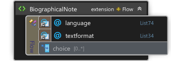</td>
        <td>

&lt;xs:element name="BiographicalNote"&gt;

&#160; &#160; &lt;xs:complexType&gt;

&#160; &#160; &#160; &#160; &lt;xs:complexContent&gt;

&#160; &#160; &#160; &#160; &#160; &#160; &lt;xs:extension base="Flow"&gt;

&#160; &#160; &#160; &#160; &#160; &#160; &#160; &#160; &lt;xs:attributeGroup ref="languageAttribute" /&gt;

&#160; &#160; &#160; &#160; &#160; &#160; &#160; &#160; &lt;xs:attributeGroup ref="textformatAttribute" /&gt;

&#160; &#160; &#160; &#160; &#160; &#160; &lt;/xs:extension&gt;

&#160; &#160; &#160; &#160; &lt;/xs:complexContent&gt;

&#160; &#160; &lt;/xs:complexType&gt;

&lt;/xs:element&gt;

</td>
    </tr>
    <tr>
        <td></td>
        <td>

&lt;xs:element name="BookClubAdoption"&gt;

&#160; &#160; &lt;xs:complexType&gt;

&#160; &#160; &#160; &#160; &lt;xs:complexContent&gt;

&#160; &#160; &#160; &#160; &#160; &#160; &lt;xs:extension base="Flow"&gt;

&#160; &#160; &#160; &#160; &#160; &#160; &#160; &#160; &lt;xs:attributeGroup ref="languageAttribute" /&gt;

&#160; &#160; &#160; &#160; &#160; &#160; &#160; &#160; &lt;xs:attributeGroup ref="textformatAttribute" /&gt;

&#160; &#160; &#160; &#160; &#160; &#160; &lt;/xs:extension&gt;

&#160; &#160; &#160; &#160; &lt;/xs:complexContent&gt;

&#160; &#160; &lt;/xs:complexType&gt;

&lt;/xs:element&gt;

</td>
    </tr>
    <tr>
        <td>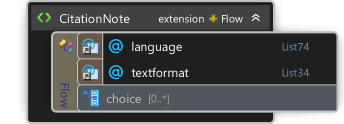</td>
        <td>

&lt;xs:element name="CitationNote"&gt;

&#160; &#160; &lt;xs:complexType&gt;

&#160; &#160; &#160; &#160; &lt;xs:complexContent&gt;

&#160; &#160; &#160; &#160; &#160; &#160; &lt;xs:extension base="Flow"&gt;

&#160; &#160; &#160; &#160; &#160; &#160; &#160; &#160; &lt;xs:attributeGroup ref="languageAttribute" /&gt;

&#160; &#160; &#160; &#160; &#160; &#160; &#160; &#160; &lt;xs:attributeGroup ref="textformatAttribute" /&gt;

&#160; &#160; &#160; &#160; &#160; &#160; &lt;/xs:extension&gt;

&#160; &#160; &#160; &#160; &lt;/xs:complexContent&gt;

&#160; &#160; &lt;/xs:complexType&gt;

&lt;/xs:element&gt;

</td>
    </tr>
    <tr>
        <td>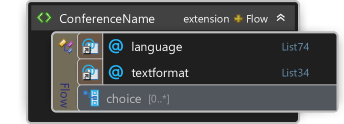</td>
        <td>

&lt;xs:element name="ConferenceName"&gt;

&#160; &#160; &lt;xs:complexType&gt;

&#160; &#160; &#160; &#160; &lt;xs:complexContent&gt;

&#160; &#160; &#160; &#160; &#160; &#160; &lt;xs:extension base="Flow"&gt;

&#160; &#160; &#160; &#160; &#160; &#160; &#160; &#160; &lt;xs:attributeGroup ref="languageAttribute" /&gt;

&#160; &#160; &#160; &#160; &#160; &#160; &#160; &#160; &lt;xs:attributeGroup ref="textformatAttribute" /&gt;

&#160; &#160; &#160; &#160; &#160; &#160; &lt;/xs:extension&gt;

&#160; &#160; &#160; &#160; &lt;/xs:complexContent&gt;

&#160; &#160; &lt;/xs:complexType&gt;

&lt;/xs:element&gt;

</td>
    </tr>
    <tr>
        <td></td>
        <td>

&lt;xs:element name="ConferenceTheme"&gt;

&#160; &#160; &lt;xs:complexType&gt;

&#160; &#160; &#160; &#160; &lt;xs:complexContent&gt;

&#160; &#160; &#160; &#160; &#160; &#160; &lt;xs:extension base="Flow"&gt;

&#160; &#160; &#160; &#160; &#160; &#160; &#160; &#160; &lt;xs:attributeGroup ref="languageAttribute" /&gt;

&#160; &#160; &#160; &#160; &#160; &#160; &#160; &#160; &lt;xs:attributeGroup ref="textformatAttribute" /&gt;

&#160; &#160; &#160; &#160; &#160; &#160; &lt;/xs:extension&gt;

&#160; &#160; &#160; &#160; &lt;/xs:complexContent&gt;

&#160; &#160; &lt;/xs:complexType&gt;

&lt;/xs:element&gt;

</td>
    </tr>
    <tr>
        <td></td>
        <td>

&lt;xs:element name="ContributorDescription"&gt;

&#160; &#160; &lt;xs:complexType&gt;

&#160; &#160; &#160; &#160; &lt;xs:complexContent&gt;

&#160; &#160; &#160; &#160; &#160; &#160; &lt;xs:extension base="Flow"&gt;

&#160; &#160; &#160; &#160; &#160; &#160; &#160; &#160; &lt;xs:attributeGroup ref="languageAttribute" /&gt;

&#160; &#160; &#160; &#160; &#160; &#160; &#160; &#160; &lt;xs:attributeGroup ref="textformatAttribute" /&gt;

&#160; &#160; &#160; &#160; &#160; &#160; &lt;/xs:extension&gt;

&#160; &#160; &#160; &#160; &lt;/xs:complexContent&gt;

&#160; &#160; &lt;/xs:complexType&gt;

&lt;/xs:element&gt;

</td>
    </tr>
    <tr>
        <td></td>
        <td>

&lt;xs:element name="ContributorStatement"&gt;

&#160; &#160; &lt;xs:complexType&gt;

&#160; &#160; &#160; &#160; &lt;xs:complexContent&gt;

&#160; &#160; &#160; &#160; &#160; &#160; &lt;xs:extension base="Flow"&gt;

&#160; &#160; &#160; &#160; &#160; &#160; &#160; &#160; &lt;xs:attributeGroup ref="languageAttribute" /&gt;

&#160; &#160; &#160; &#160; &#160; &#160; &#160; &#160; &lt;xs:attributeGroup ref="textformatAttribute" /&gt;

&#160; &#160; &#160; &#160; &#160; &#160; &lt;/xs:extension&gt;

&#160; &#160; &#160; &#160; &lt;/xs:complexContent&gt;

&#160; &#160; &lt;/xs:complexType&gt;

&lt;/xs:element&gt;

</td>
    </tr>
    <tr>
        <td></td>
        <td>

&lt;xs:element name="CopiesSold"&gt;

&#160; &#160; &lt;xs:complexType&gt;

&#160; &#160; &#160; &#160; &lt;xs:complexContent&gt;

&#160; &#160; &#160; &#160; &#160; &#160; &lt;xs:extension base="Flow"&gt;

&#160; &#160; &#160; &#160; &#160; &#160; &#160; &#160; &lt;xs:attributeGroup ref="languageAttribute" /&gt;

&#160; &#160; &#160; &#160; &#160; &#160; &#160; &#160; &lt;xs:attributeGroup ref="textformatAttribute" /&gt;

&#160; &#160; &#160; &#160; &#160; &#160; &lt;/xs:extension&gt;

&#160; &#160; &#160; &#160; &lt;/xs:complexContent&gt;

&#160; &#160; &lt;/xs:complexType&gt;

&lt;/xs:element&gt;

</td>
    </tr>
    <tr>
        <td>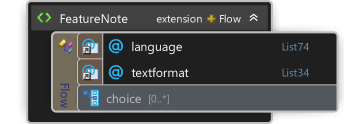</td>
        <td>

&lt;xs:element name="FeatureNote"&gt;

&#160; &#160; &lt;xs:complexType&gt;

&#160; &#160; &#160; &#160; &lt;xs:complexContent&gt;

&#160; &#160; &#160; &#160; &#160; &#160; &lt;xs:extension base="Flow"&gt;

&#160; &#160; &#160; &#160; &#160; &#160; &#160; &#160; &lt;xs:attributeGroup ref="languageAttribute" /&gt;

&#160; &#160; &#160; &#160; &#160; &#160; &#160; &#160; &lt;xs:attributeGroup ref="textformatAttribute" /&gt;

&#160; &#160; &#160; &#160; &#160; &#160; &lt;/xs:extension&gt;

&#160; &#160; &#160; &#160; &lt;/xs:complexContent&gt;

&#160; &#160; &lt;/xs:complexType&gt;

&lt;/xs:element&gt;

</td>
    </tr>
    <tr>
        <td>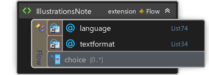</td>
        <td>

&lt;xs:element name="IllustrationsNote"&gt;

&#160; &#160; &lt;xs:complexType&gt;

&#160; &#160; &#160; &#160; &lt;xs:complexContent&gt;

&#160; &#160; &#160; &#160; &#160; &#160; &lt;xs:extension base="Flow"&gt;

&#160; &#160; &#160; &#160; &#160; &#160; &#160; &#160; &lt;xs:attributeGroup ref="languageAttribute" /&gt;

&#160; &#160; &#160; &#160; &#160; &#160; &#160; &#160; &lt;xs:attributeGroup ref="textformatAttribute" /&gt;

&#160; &#160; &#160; &#160; &#160; &#160; &lt;/xs:extension&gt;

&#160; &#160; &#160; &#160; &lt;/xs:complexContent&gt;

&#160; &#160; &lt;/xs:complexType&gt;

&lt;/xs:element&gt;

</td>
    </tr>
    <tr>
        <td>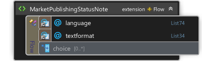</td>
        <td>

&lt;xs:element name="MarketPublishingStatusNote"&gt;

&#160; &#160; &lt;xs:complexType&gt;

&#160; &#160; &#160; &#160; &lt;xs:complexContent&gt;

&#160; &#160; &#160; &#160; &#160; &#160; &lt;xs:extension base="Flow"&gt;

&#160; &#160; &#160; &#160; &#160; &#160; &#160; &#160; &lt;xs:attributeGroup ref="languageAttribute" /&gt;

&#160; &#160; &#160; &#160; &#160; &#160; &#160; &#160; &lt;xs:attributeGroup ref="textformatAttribute" /&gt;

&#160; &#160; &#160; &#160; &#160; &#160; &lt;/xs:extension&gt;

&#160; &#160; &#160; &#160; &lt;/xs:complexContent&gt;

&#160; &#160; &lt;/xs:complexType&gt;

&lt;/xs:element&gt;

</td>
    </tr>
    <tr>
        <td>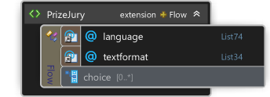</td>
        <td>

&lt;xs:element name="PrizeJury"&gt;

&#160; &#160; &lt;xs:complexType&gt;

&#160; &#160; &#160; &#160; &lt;xs:complexContent&gt;

&#160; &#160; &#160; &#160; &#160; &#160; &lt;xs:extension base="Flow"&gt;

&#160; &#160; &#160; &#160; &#160; &#160; &#160; &#160; &lt;xs:attributeGroup ref="languageAttribute" /&gt;

&#160; &#160; &#160; &#160; &#160; &#160; &#160; &#160; &lt;xs:attributeGroup ref="textformatAttribute" /&gt;

&#160; &#160; &#160; &#160; &#160; &#160; &lt;/xs:extension&gt;

&#160; &#160; &#160; &#160; &lt;/xs:complexContent&gt;

&#160; &#160; &lt;/xs:complexType&gt;

&lt;/xs:element&gt;

</td>
    </tr>
    <tr>
        <td></td>
        <td>

&lt;xs:element name="PromotionCampaign"&gt;

&#160; &#160; &lt;xs:complexType&gt;

&#160; &#160; &#160; &#160; &lt;xs:complexContent&gt;

&#160; &#160; &#160; &#160; &#160; &#160; &lt;xs:extension base="Flow"&gt;

&#160; &#160; &#160; &#160; &#160; &#160; &#160; &#160; &lt;xs:attributeGroup ref="languageAttribute" /&gt;

&#160; &#160; &#160; &#160; &#160; &#160; &#160; &#160; &lt;xs:attributeGroup ref="textformatAttribute" /&gt;

&#160; &#160; &#160; &#160; &#160; &#160; &lt;/xs:extension&gt;

&#160; &#160; &#160; &#160; &lt;/xs:complexContent&gt;

&#160; &#160; &lt;/xs:complexType&gt;

&lt;/xs:element&gt;

</td>
    </tr>
    <tr>
        <td></td>
        <td>

&lt;xs:element name="PromotionContact"&gt;

&#160; &#160; &lt;xs:complexType&gt;

&#160; &#160; &#160; &#160; &lt;xs:complexContent&gt;

&#160; &#160; &#160; &#160; &#160; &#160; &lt;xs:extension base="Flow"&gt;

&#160; &#160; &#160; &#160; &#160; &#160; &#160; &#160; &lt;xs:attributeGroup ref="languageAttribute" /&gt;

&#160; &#160; &#160; &#160; &#160; &#160; &#160; &#160; &lt;xs:attributeGroup ref="textformatAttribute" /&gt;

&#160; &#160; &#160; &#160; &#160; &#160; &lt;/xs:extension&gt;

&#160; &#160; &#160; &#160; &lt;/xs:complexContent&gt;

&#160; &#160; &lt;/xs:complexType&gt;

&lt;/xs:element&gt;

</td>
    </tr>
    <tr>
        <td></td>
        <td>

&lt;xs:element name="PublishingStatusNote"&gt;

&#160; &#160; &lt;xs:complexType&gt;

&#160; &#160; &#160; &#160; &lt;xs:complexContent&gt;

&#160; &#160; &#160; &#160; &#160; &#160; &lt;xs:extension base="Flow"&gt;

&#160; &#160; &#160; &#160; &#160; &#160; &#160; &#160; &lt;xs:attributeGroup ref="languageAttribute" /&gt;

&#160; &#160; &#160; &#160; &#160; &#160; &#160; &#160; &lt;xs:attributeGroup ref="textformatAttribute" /&gt;

&#160; &#160; &#160; &#160; &#160; &#160; &lt;/xs:extension&gt;

&#160; &#160; &#160; &#160; &lt;/xs:complexContent&gt;

&#160; &#160; &lt;/xs:complexType&gt;

&lt;/xs:element&gt;

</td>
    </tr>
    <tr>
        <td>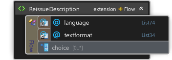</td>
        <td>

&#160; &#160; &lt;xs:element name="ReissueDescription"&gt;

&#160; &#160; &#160; &#160; &lt;xs:complexType&gt;

&#160; &#160; &#160; &#160; &#160; &#160; &lt;xs:complexContent&gt;

&#160; &#160; &#160; &#160; &#160; &#160; &#160; &#160; &lt;xs:extension base="Flow"&gt;

&#160; &#160; &#160; &#160; &#160; &#160; &#160; &#160; &#160; &#160; &lt;xs:attributeGroup ref="languageAttribute" /&gt;

&#160; &#160; &#160; &#160; &#160; &#160; &#160; &#160; &#160; &#160; &lt;xs:attributeGroup ref="textformatAttribute" /&gt;

&#160; &#160; &#160; &#160; &#160; &#160; &#160; &#160; &lt;/xs:extension&gt;

&#160; &#160; &#160; &#160; &#160; &#160; &lt;/xs:complexContent&gt;

&#160; &#160; &#160; &#160; &lt;/xs:complexType&gt;

&#160; &#160; &lt;/xs:element&gt;

</td>
    </tr>
    <tr>
        <td>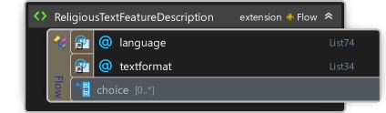</td>
        <td>

&lt;xs:element name="ReligiousTextFeatureDescription"&gt;

&#160; &#160; &lt;xs:complexType&gt;

&#160; &#160; &#160; &#160; &lt;xs:complexContent&gt;

&#160; &#160; &#160; &#160; &#160; &#160; &lt;xs:extension base="Flow"&gt;

&#160; &#160; &#160; &#160; &#160; &#160; &#160; &#160; &lt;xs:attributeGroup ref="languageAttribute" /&gt;

&#160; &#160; &#160; &#160; &#160; &#160; &#160; &#160; &lt;xs:attributeGroup ref="textformatAttribute" /&gt;

&#160; &#160; &#160; &#160; &#160; &#160; &lt;/xs:extension&gt;

&#160; &#160; &#160; &#160; &lt;/xs:complexContent&gt;

&#160; &#160; &lt;/xs:complexType&gt;

&lt;/xs:element&gt;

</td>
    </tr>
    <tr>
        <td>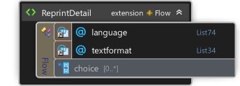</td>
        <td>

&lt;xs:element name="ReprintDetail"&gt;

&#160; &#160; &lt;xs:complexType&gt;

&#160; &#160; &#160; &#160; &lt;xs:complexContent&gt;

&#160; &#160; &#160; &#160; &#160; &#160; &lt;xs:extension base="Flow"&gt;

&#160; &#160; &#160; &#160; &#160; &#160; &#160; &#160; &lt;xs:attributeGroup ref="languageAttribute" /&gt;

&#160; &#160; &#160; &#160; &#160; &#160; &#160; &#160; &lt;xs:attributeGroup ref="textformatAttribute" /&gt;

&#160; &#160; &#160; &#160; &#160; &#160; &lt;/xs:extension&gt;

&#160; &#160; &#160; &#160; &lt;/xs:complexContent&gt;

&#160; &#160; &lt;/xs:complexType&gt;

&lt;/xs:element&gt;

</td>
    </tr>
    <tr>
        <td></td>
        <td>

&lt;xs:element name="SalesRestrictionNote"&gt;

&#160; &#160; &lt;xs:complexType&gt;

&#160; &#160; &#160; &#160; &lt;xs:complexContent&gt;

&#160; &#160; &#160; &#160; &#160; &#160; &lt;xs:extension base="Flow"&gt;

&#160; &#160; &#160; &#160; &#160; &#160; &#160; &#160; &lt;xs:attributeGroup ref="languageAttribute" /&gt;

&#160; &#160; &#160; &#160; &#160; &#160; &#160; &#160; &lt;xs:attributeGroup ref="textformatAttribute" /&gt;

&#160; &#160; &#160; &#160; &#160; &#160; &lt;/xs:extension&gt;

&#160; &#160; &#160; &#160; &lt;/xs:complexContent&gt;

&#160; &#160; &lt;/xs:complexType&gt;

&lt;/xs:element&gt;

</td>
    </tr>
    <tr>
        <td>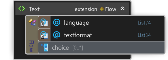</td>
        <td>

&lt;xs:element name="Text"&gt;

&#160; &#160; &lt;xs:complexType&gt;

&#160; &#160; &#160; &#160; &lt;xs:complexContent&gt;

&#160; &#160; &#160; &#160; &#160; &#160; &lt;xs:extension base="Flow"&gt;

&#160; &#160; &#160; &#160; &#160; &#160; &#160; &#160; &lt;xs:attributeGroup ref="languageAttribute" /&gt;

&#160; &#160; &#160; &#160; &#160; &#160; &#160; &#160; &lt;xs:attributeGroup ref="textformatAttribute" /&gt;

&#160; &#160; &#160; &#160; &#160; &#160; &lt;/xs:extension&gt;

&#160; &#160; &#160; &#160; &lt;/xs:complexContent&gt;

&#160; &#160; &lt;/xs:complexType&gt;

&lt;/xs:element&gt;

</td>
    </tr>
    <tr>
        <td>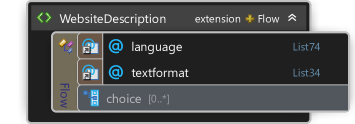</td>
        <td>

&lt;xs:element name="WebsiteDescription"&gt;

&#160; &#160; &lt;xs:complexType&gt;

&#160; &#160; &#160; &#160; &lt;xs:complexContent&gt;

&#160; &#160; &#160; &#160; &#160; &#160; &lt;xs:extension base="Flow"&gt;

&#160; &#160; &#160; &#160; &#160; &#160; &#160; &#160; &lt;xs:attributeGroup ref="languageAttribute" /&gt;

&#160; &#160; &#160; &#160; &#160; &#160; &#160; &#160; &lt;xs:attributeGroup ref="textformatAttribute" /&gt;

&#160; &#160; &#160; &#160; &#160; &#160; &lt;/xs:extension&gt;

&#160; &#160; &#160; &#160; &lt;/xs:complexContent&gt;

&#160; &#160; &lt;/xs:complexType&gt;

&lt;/xs:element&gt;

</td>
    </tr>
</table>