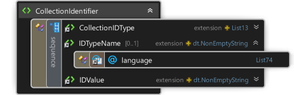
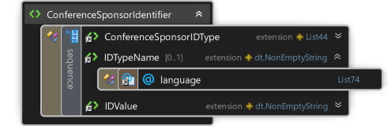
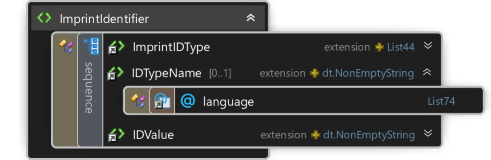
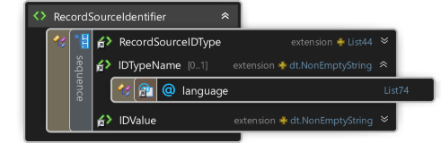
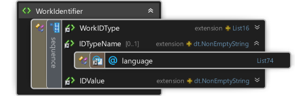

<table>
    <tr><th colspan="2">3.0.12</th></tr>
    <tr>
        <td id="AddresseeIdentifier"></td>
        <td>

&lt;xs:element name="AddresseeIdentifier"&gt;

&#160; &#160; &lt;xs:complexType&gt;

&#160; &#160; &#160; &#160; &lt;xs:sequence&gt;

&#160; &#160; &#160; &#160; &#160; &#160; &lt;xs:element ref="AddresseeIDType" /&gt;

&#160; &#160; &#160; &#160; &#160; &#160; &lt;xs:element ref="IDTypeName" minOccurs="0" /&gt;

&#160; &#160; &#160; &#160; &#160; &#160; &lt;xs:element ref="IDValue" /&gt;

&#160; &#160; &#160; &#160; &lt;/xs:sequence&gt;

&#160; &#160; &lt;/xs:complexType&gt;

&lt;/xs:element&gt;

</td>
    </tr>
    <tr>
        <td id="AgentIdentifier"></td>
        <td>

&lt;xs:element name="AgentIdentifier"&gt;

&#160; &#160; &lt;xs:complexType&gt;

&#160; &#160; &#160; &#160; &lt;xs:sequence&gt;

&#160; &#160; &#160; &#160; &#160; &#160; &lt;xs:element ref="AgentIDType" /&gt;

&#160; &#160; &#160; &#160; &#160; &#160; &lt;xs:element ref="IDTypeName" minOccurs="0" /&gt;

&#160; &#160; &#160; &#160; &#160; &#160; &lt;xs:element ref="IDValue" /&gt;

&#160; &#160; &#160; &#160; &lt;/xs:sequence&gt;

&#160; &#160; &lt;/xs:complexType&gt;

&lt;/xs:element&gt;

</td>
    </tr>
    <tr>
        <td id="CollectionIdentifier"></td>
        <td>

&lt;xs:element name="CollectionIdentifier"&gt;

&#160; &#160; &lt;xs:complexType&gt;

&#160; &#160; &#160; &#160; &lt;xs:sequence&gt;

&#160; &#160; &#160; &#160; &#160; &#160; &lt;xs:element ref="CollectionIDType" /&gt;

&#160; &#160; &#160; &#160; &#160; &#160; &lt;xs:element ref="IDTypeName" minOccurs="0" /&gt;

&#160; &#160; &#160; &#160; &#160; &#160; &lt;xs:element ref="IDValue" /&gt;

&#160; &#160; &#160; &#160; &lt;/xs:sequence&gt;

&#160; &#160; &lt;/xs:complexType&gt;

&lt;/xs:element&gt;

</td>
    </tr>
    <tr>
        <td id="ConferenceSponsorIdentifier"></td>
        <td>

&lt;xs:element name="ConferenceSponsorIdentifier"&gt;

&#160; &#160; &lt;xs:complexType&gt;

&#160; &#160; &#160; &#160; &lt;xs:sequence&gt;

&#160; &#160; &#160; &#160; &#160; &#160; &lt;xs:element ref="ConferenceSponsorIDType" /&gt;

&#160; &#160; &#160; &#160; &#160; &#160; &lt;xs:element ref="IDTypeName" minOccurs="0" /&gt;

&#160; &#160; &#160; &#160; &#160; &#160; &lt;xs:element ref="IDValue" /&gt;

&#160; &#160; &#160; &#160; &lt;/xs:sequence&gt;

&#160; &#160; &lt;/xs:complexType&gt;

&lt;/xs:element&gt;

</td>
    </tr>
    <tr>
        <td id="CopyrightOwnerIdentifier"></td>
        <td>

&lt;xs:element name="CopyrightOwnerIdentifier"&gt;

&#160; &#160; &lt;xs:complexType&gt;

&#160; &#160; &#160; &#160; &lt;xs:sequence&gt;

&#160; &#160; &#160; &#160; &#160; &#160; &lt;xs:element ref="CopyrightOwnerIDType" /&gt;

&#160; &#160; &#160; &#160; &#160; &#160; &lt;xs:element ref="IDTypeName" minOccurs="0" /&gt;

&#160; &#160; &#160; &#160; &#160; &#160; &lt;xs:element ref="IDValue" /&gt;

&#160; &#160; &#160; &#160; &lt;/xs:sequence&gt;

&#160; &#160; &lt;/xs:complexType&gt;

&lt;/xs:element&gt;

</td>
    </tr>
    <tr>
        <td id="ImprintIdentifier"></td>
        <td>

&lt;xs:element name="ImprintIdentifier"&gt;

&#160; &#160; &lt;xs:complexType&gt;

&#160; &#160; &#160; &#160; &lt;xs:sequence&gt;

&#160; &#160; &#160; &#160; &#160; &#160; &lt;xs:element ref="ImprintIDType" /&gt;

&#160; &#160; &#160; &#160; &#160; &#160; &lt;xs:element ref="IDTypeName" minOccurs="0" /&gt;

&#160; &#160; &#160; &#160; &#160; &#160; &lt;xs:element ref="IDValue" /&gt;

&#160; &#160; &#160; &#160; &lt;/xs:sequence&gt;

&#160; &#160; &lt;/xs:complexType&gt;

&lt;/xs:element&gt;

</td>
    </tr>
    <tr>
        <td id="LocationIdentifier"></td>
        <td>

&lt;xs:element name="LocationIdentifier"&gt;

&#160; &#160; &lt;xs:complexType&gt;

&#160; &#160; &#160; &#160; &lt;xs:sequence&gt;

&#160; &#160; &#160; &#160; &#160; &#160; &lt;xs:element ref="LocationIDType" /&gt;

&#160; &#160; &#160; &#160; &#160; &#160; &lt;xs:element ref="IDTypeName" minOccurs="0" /&gt;

&#160; &#160; &#160; &#160; &#160; &#160; &lt;xs:element ref="IDValue" /&gt;

&#160; &#160; &#160; &#160; &lt;/xs:sequence&gt;

&#160; &#160; &lt;/xs:complexType&gt;

&lt;/xs:element&gt;

</td>
    </tr>
    <tr>
        <td id="NameIdentifier"></td>
        <td>

&lt;xs:element name="NameIdentifier"&gt;

&#160; &#160; &lt;xs:complexType&gt;

&#160; &#160; &#160; &#160; &lt;xs:sequence&gt;

&#160; &#160; &#160; &#160; &#160; &#160; &lt;xs:element ref="NameIDType" /&gt;

&#160; &#160; &#160; &#160; &#160; &#160; &lt;xs:element ref="IDTypeName" minOccurs="0" /&gt;

&#160; &#160; &#160; &#160; &#160; &#160; &lt;xs:element ref="IDValue" /&gt;

&#160; &#160; &#160; &#160; &lt;/xs:sequence&gt;

&#160; &#160; &lt;/xs:complexType&gt;

&lt;/xs:element&gt;

</td>
    </tr>
    <tr>
        <td id="ProductIdentifier"></td>
        <td>

&lt;xs:element name="ProductIdentifier"&gt;

&#160; &#160; &lt;xs:complexType&gt;

&#160; &#160; &#160; &#160; &lt;xs:sequence&gt;

&#160; &#160; &#160; &#160; &#160; &#160; &lt;xs:element ref="ProductIDType" /&gt;

&#160; &#160; &#160; &#160; &#160; &#160; &lt;xs:element ref="IDTypeName" minOccurs="0" /&gt;

&#160; &#160; &#160; &#160; &#160; &#160; &lt;xs:element ref="IDValue" /&gt;

&#160; &#160; &#160; &#160; &lt;/xs:sequence&gt;

&#160; &#160; &lt;/xs:complexType&gt;

&lt;/xs:element&gt;

</td>
    </tr>
    <tr>
        <td id="PublisherIdentifier"></td>
        <td>

&lt;xs:element name="PublisherIdentifier"&gt;

&#160; &#160; &lt;xs:complexType&gt;

&#160; &#160; &#160; &#160; &lt;xs:sequence&gt;

&#160; &#160; &#160; &#160; &#160; &#160; &lt;xs:element ref="PublisherIDType" /&gt;

&#160; &#160; &#160; &#160; &#160; &#160; &lt;xs:element ref="IDTypeName" minOccurs="0" /&gt;

&#160; &#160; &#160; &#160; &#160; &#160; &lt;xs:element ref="IDValue" /&gt;

&#160; &#160; &#160; &#160; &lt;/xs:sequence&gt;

&#160; &#160; &lt;/xs:complexType&gt;

&lt;/xs:element&gt;

</td>
    </tr>
    <tr>
        <td id="RecordSourceIdentifier"></td>
        <td>

&lt;xs:element name="RecordSourceIdentifier"&gt;

&#160; &#160; &lt;xs:complexType&gt;

&#160; &#160; &#160; &#160; &lt;xs:sequence&gt;

&#160; &#160; &#160; &#160; &#160; &#160; &lt;xs:element ref="RecordSourceIDType" /&gt;

&#160; &#160; &#160; &#160; &#160; &#160; &lt;xs:element ref="IDTypeName" minOccurs="0" /&gt;

&#160; &#160; &#160; &#160; &#160; &#160; &lt;xs:element ref="IDValue" /&gt;

&#160; &#160; &#160; &#160; &lt;/xs:sequence&gt;

&#160; &#160; &lt;/xs:complexType&gt;

&lt;/xs:element&gt;

</td>
    </tr>
    <tr>
        <td id="SalesOutletIdentifier"></td>
        <td>

&lt;xs:element name="SalesOutletIdentifier"&gt;

&#160; &#160; &lt;xs:complexType&gt;

&#160; &#160; &#160; &#160; &lt;xs:sequence&gt;

&#160; &#160; &#160; &#160; &#160; &#160; &lt;xs:element ref="SalesOutletIDType" /&gt;

&#160; &#160; &#160; &#160; &#160; &#160; &lt;xs:element ref="IDTypeName" minOccurs="0" /&gt;

&#160; &#160; &#160; &#160; &#160; &#160; &lt;xs:element ref="IDValue" /&gt;

&#160; &#160; &#160; &#160; &lt;/xs:sequence&gt;

&#160; &#160; &lt;/xs:complexType&gt;

&lt;/xs:element&gt;

</td>
    </tr>
    <tr>
        <td id="SenderIdentifier"></td>
        <td>

&lt;xs:element name="SenderIdentifier"&gt;

&#160; &#160; &lt;xs:complexType&gt;

&#160; &#160; &#160; &#160; &lt;xs:sequence&gt;

&#160; &#160; &#160; &#160; &#160; &#160; &lt;xs:element ref="SenderIDType" /&gt;

&#160; &#160; &#160; &#160; &#160; &#160; &lt;xs:element ref="IDTypeName" minOccurs="0" /&gt;

&#160; &#160; &#160; &#160; &#160; &#160; &lt;xs:element ref="IDValue" /&gt;

&#160; &#160; &#160; &#160; &lt;/xs:sequence&gt;

&#160; &#160; &lt;/xs:complexType&gt;

&lt;/xs:element&gt;

</td>
    </tr>
    <tr>
        <td id="SupplierIdentifier"></td>
        <td>

&lt;xs:element name="SupplierIdentifier"&gt;

&#160; &#160; &lt;xs:complexType&gt;

&#160; &#160; &#160; &#160; &lt;xs:sequence&gt;

&#160; &#160; &#160; &#160; &#160; &#160; &lt;xs:element ref="SupplierIDType" /&gt;

&#160; &#160; &#160; &#160; &#160; &#160; &lt;xs:element ref="IDTypeName" minOccurs="0" /&gt;

&#160; &#160; &#160; &#160; &#160; &#160; &lt;xs:element ref="IDValue" /&gt;

&#160; &#160; &#160; &#160; &lt;/xs:sequence&gt;

&#160; &#160; &lt;/xs:complexType&gt;

&lt;/xs:element&gt;

</td>
    </tr>
    <tr>
        <td id="TextItemIdentifier"></td>
        <td>

&lt;xs:element name="TextItemIdentifier"&gt;

&#160; &#160; &lt;xs:complexType&gt;

&#160; &#160; &#160; &#160; &lt;xs:sequence&gt;

&#160; &#160; &#160; &#160; &#160; &#160; &lt;xs:element ref="TextItemIDType" /&gt;

&#160; &#160; &#160; &#160; &#160; &#160; &lt;xs:element ref="IDTypeName" minOccurs="0" /&gt;

&#160; &#160; &#160; &#160; &#160; &#160; &lt;xs:element ref="IDValue" /&gt;

&#160; &#160; &#160; &#160; &lt;/xs:sequence&gt;

&#160; &#160; &lt;/xs:complexType&gt;

&lt;/xs:element&gt;

</td>
    </tr>
    <tr>
        <td id="WorkIdentifier"></td>
        <td>

&lt;xs:element name="WorkIdentifier"&gt;

&#160; &#160; &lt;xs:complexType&gt;

&#160; &#160; &#160; &#160; &lt;xs:sequence&gt;

&#160; &#160; &#160; &#160; &#160; &#160; &lt;xs:element ref="WorkIDType" /&gt;

&#160; &#160; &#160; &#160; &#160; &#160; &lt;xs:element ref="IDTypeName" minOccurs="0" /&gt;

&#160; &#160; &#160; &#160; &#160; &#160; &lt;xs:element ref="IDValue" /&gt;

&#160; &#160; &#160; &#160; &lt;/xs:sequence&gt;

&#160; &#160; &lt;/xs:complexType&gt;

&lt;/xs:element&gt;

</td>
    </tr>
</table>