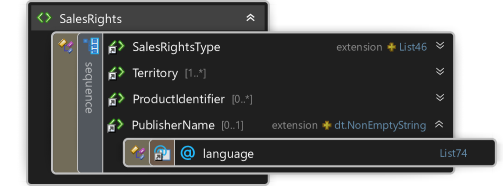
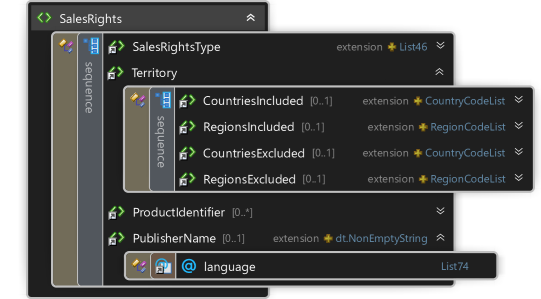

<table>
    <tr><th colspan="2">3.0.12</th></tr>
    <tr>
        <td></td>
        <td>

&lt;xs:element name="SalesRights"&gt;

&#160; &#160; &lt;xs:complexType&gt;

&#160; &#160; &#160; &#160; &lt;xs:sequence&gt;

&#160; &#160; &#160; &#160; &#160; &#160; &lt;xs:element ref="SalesRightsType" /&gt;

&#160; &#160; &#160; &#160; &#160; &#160; &lt;xs:element ref="Territory" maxOccurs="unbounded" /&gt;

&#160; &#160; &#160; &#160; &#160; &#160; &lt;xs:element ref="ProductIdentifier" minOccurs="0" maxOccurs="unbounded" /&gt;

&#160; &#160; &#160; &#160; &#160; &#160; &lt;xs:element ref="PublisherName" minOccurs="0" /&gt;

&#160; &#160; &#160; &#160; &lt;/xs:sequence&gt;

&#160; &#160; &lt;/xs:complexType&gt;

&lt;/xs:element&gt;

</td>
    </tr>
    <tr><th colspan="2">3.0.14</th></tr>
    <tr>
        <td></td>
        <td>

&lt;xs:element name="SalesRights"&gt;

&#160; &#160; &lt;xs:complexType&gt;

&#160; &#160; &#160; &#160; &lt;xs:sequence&gt;

&#160; &#160; &#160; &#160; &#160; &#160; &lt;xs:element ref="SalesRightsType" /&gt;

&#160; &#160; &#160; &#160; &#160; &#160; &lt;xs:element ref="Territory" /&gt;

&#160; &#160; &#160; &#160; &#160; &#160; &lt;xs:element ref="ProductIdentifier" minOccurs="0" maxOccurs="unbounded" /&gt;

&#160; &#160; &#160; &#160; &#160; &#160; &lt;xs:element ref="PublisherName" minOccurs="0" /&gt;

&#160; &#160; &#160; &#160; &lt;/xs:sequence&gt;

&#160; &#160; &lt;/xs:complexType&gt;

&lt;/xs:element&gt;

</td>
    </tr>
</table>